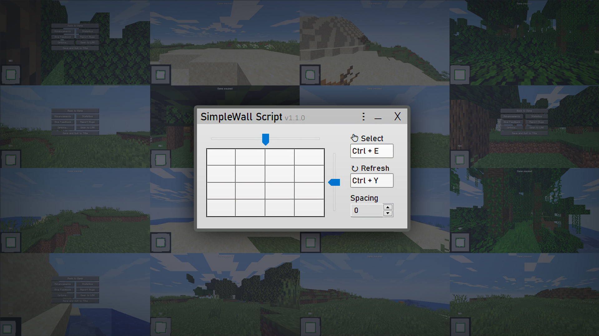

  

  <h1 align="center">SimpleWall Script</h1>

  

    Multi instance Minecraft wall for finding speedrun seeds.
    <!--  
    <a href="https://reponame/issues/new?template=bug.md">Report bug</a>
    ·
    <a href="https://reponame/issues/new?template=feature.md&labels=feature">Request feature</a> -->
  

  

<!-- ## Download -->
## [Download the SimpleWall Script](https://github.com/Jesper-Hustad/SimpleWallScript/releases/download/v0.2/SimpleWallScript.ahk)

<!-- Other version that does not fullscreen: [Modified Script without fullscreen](https://github.com/Jesper-Hustad/SimpleWallScript/releases/download/Alpha/SimpleWallScript.ahk)   -->

## Setting up multiple Minecraft instances
This script assumes you have multiple instances of minecraft running using MultiMC or similar.  
Learn how to setup minecraft with MultiMC and speedrunning mods here: https://www.youtube.com/watch?v=VL8Syekw4Q0.  
After setting up MultiMC select an instance and click "Copy Instance" to create more.

## Feedback wanted!
Experiencing any bugs?  
Is there an optimization or feature that you think should be implemented?  
[Create a new issue here on github](https://github.com/Jesper-Hustad/SimpleWallScript/issues/new/choose) and we will take your feedback.

