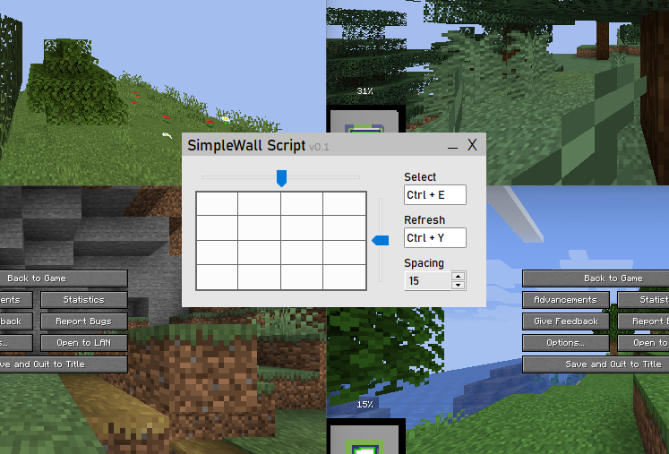

# SimpleWall Script

AutoHotKey Script that creates a wall of Minecraft instances and automatically generate new worlds to increase the speed of finding good seeds for speedrunning.

## Download
### [Download the SimpleWall Script](https://github.com/Jesper-Hustad/SimpleWallScript/releases/latest)

<!-- Other version that does not fullscreen: [Modified Script without fullscreen](https://github.com/Jesper-Hustad/SimpleWallScript/releases/download/Alpha/SimpleWallScript.ahk)   -->

## Getting Started
1. Setup multiple Minecraft instances (see below)
2. Download the script with link above and run the .exe
3. On Windows Defender window click "more info" and "run anyway"

## Instructions
- **Reset** HotKey (Default is `CTRL + Y`) to start wall
- **Select** HotKey (Default is `CTRL + E`) while hovering mouse over Minecraft window to select it for speed-running.
- **Reset** at any time to go back to the wall

## Setting up multiple Minecraft instances
This script assumes you have multiple instances of minecraft running using MultiMC or similar.  
Learn how to setup minecraft with MultiMC and speedrunning mods here: https://www.youtube.com/watch?v=VL8Syekw4Q0.  
After setting up MultiMC select an instance and click "Copy Instance" to create more.

## What if i don't trust .exe file?
You can also run the AutoHotKey script directly (used to make the exe). Install the [current version of AutoHotKey](https://www.autohotkey.com/) and open the `SimpleWallScript.ahk` file included in the release.

## Feedback wanted!
Is there something you noticed is missing or experiencing a wierd bug? 
Is there an optimization or feature that you think should be implemented?  
[Create a new issue here on github](https://github.com/Jesper-Hustad/SimpleWallScript/issues/new/choose) and we will take your feedback.

## Features
- Make custom HotKeys for Select and Refresh 
- Adjust wall by using the sliders and visualization
- Adjust the spacing between windows
